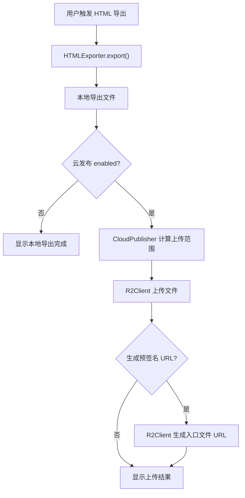

# Obsidian Webpage Export 云发布设计

## 背景

当前项目是 `kosmosisdire/obsidian-webpage-export` 的本地 clone 版本。插件已经可以将 Obsidian 笔记导出为单文件 HTML、普通网站目录或 Raw HTML Documents，但导出结果仍停留在本地文件系统。

用户希望在导出完成后，将导出产物可选上传到 Cloudflare R2，并支持生成预签名 URL。后续还希望扩展到基于 Cloudflare Worker + KV 的可撤销访问链接，但本轮只预留接口，不实现 Worker/KV 访问链路。

同时，插件设置页需要支持填写 WebDAV 信息，用于从云端拉取配置。默认只拉取云发布相关配置，避免覆盖每台设备各自的导出路径、文件选择和本地偏好；另提供显式“覆盖全部配置”入口。

## 目标

- 在插件设置页新增“云发布 / Cloud Publish”配置区。
- 导出完成后，根据配置决定是否上传到 Cloudflare R2。
- 上传范围按导出模式自动判断：
  - `combineAsSingleFile = true` 时，只上传导出的单个 HTML 文件。
  - `combineAsSingleFile = false` 时，上传整个导出目录，并保留相对路径。
- 支持选择上传后生成预签名 URL，并可配置过期时间。
- 预留 Worker/KV 可撤销链接接口，设置项和类型结构先存在，但第一版不调用。
- 支持通过 WebDAV 拉取远端配置：
  - 默认只覆盖云发布相关配置。
  - 另提供“覆盖全部插件配置”的显式操作。
- 保持导出主流程稳定：本地导出失败时不上传；上传失败时不回滚本地导出。

## 非目标

- 本轮不实现 Worker + KV 的可撤销链接创建、撤销和访问代理。
- 本轮不实现 R2 multipart 断点续传。
- 本轮不实现上传历史、分享历史、访问统计、密码访问或批量撤销。
- 本轮不实现 WebDAV 自动同步、冲突合并和版本历史。
- 本轮不改变现有导出格式、页面渲染、资源生成和缓存机制。

## 用户体验

### 设置页

在 `src/plugin/settings/settings.ts` 中新增云发布配置区，放在“导出设置”和“Obsidian设置”之间。

配置项分为三组：

1. Cloudflare R2
   - 启用导出后上传
   - 上传策略：自动、只上传文件、上传整个目录
   - Account ID
   - Access Key ID
   - Secret Access Key
   - Endpoint URL
   - Bucket
   - 上传 Key 前缀
   - 上传后生成预签名 URL
   - 预签名 URL 过期秒数

2. 可撤销链接占位
   - 分享模式：预签名 URL、可撤销链接
   - Worker Base URL
   - Worker Admin Token
   - 当选择“可撤销链接”时，第一版显示提示：该模式已预留，当前尚未实现。

3. WebDAV 配置同步
   - WebDAV URL
   - 用户名
   - 密码
   - 远端配置路径
   - 下载云发布配置
   - 覆盖全部插件配置

### 导出后行为

`HTMLExporter.export()` 成功导出后：

1. 如果未启用云发布，沿用现有行为：可选打开导出目录，并显示导出完成提示。
2. 如果启用云发布：
   - 根据导出结果和策略计算待上传文件列表。
   - 上传文件到 R2。
   - 如果启用预签名 URL，则为入口文件生成 URL。
   - 弹出 Notice 汇总上传结果。

入口文件规则：

- 单文件 HTML：入口文件为该 HTML。
- 普通网站目录：优先使用导出目录中的 `index.html`。
- 如果没有 `index.html`，使用本次导出的第一个 HTML 文件，并在 Notice 中提示。

## 配置结构

在 `Settings` 中新增 `cloudPublish` 字段。建议结构如下：

```ts
export type CloudPublishMode = "presigned-url" | "revocable-link";
export type CloudUploadStrategy = "auto" | "single-html" | "directory";

export interface CloudPublishSettings {
  enabled: boolean;
  uploadStrategy: CloudUploadStrategy;
  accountId: string;
  accessKeyId: string;
  secretAccessKey: string;
  endpointUrl: string;
  bucket: string;
  keyPrefix: string;
  publishMode: CloudPublishMode;
  createPresignedUrl: boolean;
  presignedUrlExpireSeconds: number;
  workerBaseUrl: string;
  workerAdminToken: string;
  webdavUrl: string;
  webdavUsername: string;
  webdavPassword: string;
  webdavRemotePath: string;
}
```

默认值：

- `enabled = false`
- `uploadStrategy = "auto"`
- `publishMode = "presigned-url"`
- `createPresignedUrl = true`
- `presignedUrlExpireSeconds = 604800`
- `webdavRemotePath = "obsidian-webpage-export/cloud-publish.json"`

安全说明：

- Obsidian 插件数据默认保存在本地，R2 Secret、Worker Token 和 WebDAV 密码会以明文形式保存。
- 设置页描述中应明确提示“适合个人自用场景；如需更高安全性，后续可扩展系统凭据存储”。

## 模块设计

新增目录：

```text
src/plugin/cloud-publish/
├── cloud-publish-settings.ts
├── cloud-publisher.ts
├── r2-client.ts
├── webdav-config-sync.ts
└── worker-link-client.ts
```

### `cloud-publish-settings.ts`

职责：

- 定义云发布配置类型、默认值和清洗函数。
- 提供 `sanitizeCloudPublishSettings()`，用于本地加载和 WebDAV 下载后的字段归一化。
- 提供 `pickCloudPublishSettings()`，用于从完整插件配置中提取云发布相关字段。

### `r2-client.ts`

职责：

- 使用 S3 兼容 API 上传对象到 R2。
- 使用 S3 兼容 API 为对象生成预签名 URL。
- 第一版优先使用 AWS Signature V4 的轻量实现，避免引入庞大的 AWS SDK；如果实现成本过高，再评估 `@aws-sdk/client-s3` 与 `@aws-sdk/s3-request-presigner`。
- 上传时设置合理的 `Content-Type`，HTML、CSS、JS、图片和 JSON 需要尽量正确识别。

### `cloud-publisher.ts`

职责：

- 接收导出目录、导出选项和云发布配置。
- 计算待上传文件列表。
- 将本地路径转换为 R2 object key。
- 调用 `R2Client` 上传。
- 调用 `R2Client` 生成入口文件预签名 URL。
- 统一返回发布结果。

建议返回结构：

```ts
export interface CloudPublishResult {
  uploadedCount: number;
  failedCount: number;
  entryKey?: string;
  presignedUrl?: string;
  warnings: string[];
}
```

### `worker-link-client.ts`

职责：

- 预留 Worker/KV 可撤销链接调用接口。
- 第一版只定义类型与未实现错误，不在主流程中调用。

建议预留接口：

```ts
export interface RevocableLinkRequest {
  bucket: string;
  key: string;
  expiresAt?: string;
}

export interface RevocableLinkResult {
  token: string;
  url: string;
  expiresAt?: string;
}

export class WorkerLinkClient {
  async createLink(request: RevocableLinkRequest): Promise<RevocableLinkResult> {
    throw new Error("Revocable links are reserved but not implemented yet.");
  }
}
```

### `webdav-config-sync.ts`

职责：

- 使用 Obsidian 可用的网络请求能力读取 WebDAV 远端配置。
- 下载后先解析 JSON，再按模式写入：
  - 云发布模式：只覆盖 `Settings.cloudPublish`。
  - 全量模式：覆盖完整插件配置，再重建 `exportOptions` 的 feature option 实例。
- 远端配置格式允许是完整插件配置，也允许是只包含 `cloudPublish` 的配置片段。

## 数据流



## 错误处理

- R2 配置缺失时：导出成功，但跳过上传并提示缺少字段。
- R2 上传失败时：导出成功，Notice 显示失败原因，并写入 `ExportLog.error()`。
- 部分文件上传失败时：继续上传后续文件，最后显示成功/失败数量。
- 预签名 URL 生成失败时：上传结果仍算成功，但提示 URL 生成失败。
- WebDAV 下载失败时：不修改本地配置。
- WebDAV JSON 无效时：不修改本地配置，并提示格式错误。
- “覆盖全部插件配置”执行前需要二次确认，避免误覆盖本机导出路径。

## 验证计划

1. 静态检查
   - `npm run build`
   - `npx tsc -noEmit -skipLibCheck`

2. 单元级验证
   - 云发布配置清洗函数能处理缺失字段、旧配置和异常类型。
   - 上传范围计算能覆盖单文件 HTML、目录导出、缺失 `index.html` 的情况。
   - R2 object key 会正确处理 `keyPrefix`、Windows 路径分隔符和 URL 安全路径。

3. 本地模拟验证
   - 使用临时目录模拟导出结果，验证待上传列表和入口文件识别。
   - 使用 mock R2 client 验证导出成功后会触发上传。
   - 使用本地临时 WebDAV 小服务验证配置下载与覆盖范围。

4. 手动验证
   - 在 Obsidian 中打开设置页，确认云发布配置区可显示和保存。
   - 关闭云发布时，导出行为与原插件一致。
   - 开启云发布但缺少 R2 配置时，导出成功且给出明确提示。
   - 使用真实 R2 小文件验证上传和预签名 URL 可访问。

## 实施顺序

1. 新增云发布配置类型、默认值和配置清洗。
2. 在设置页和 i18n 中增加云发布配置区。
3. 新增上传范围计算与 R2 object key 生成逻辑。
4. 新增 R2 上传与预签名 URL 生成模块。
5. 将 `HTMLExporter.export()` 成功路径接入 `CloudPublisher`。
6. 新增 WebDAV 配置下载逻辑和设置页按钮。
7. 新增 Worker/KV 可撤销链接占位接口。
8. 补充验证脚本或轻量测试，并执行构建验证。

## 风险与取舍

- R2 签名实现是主要技术风险。若手写 Signature V4 太脆弱，应改用 AWS SDK v3，但需要接受打包体积增加。
- Obsidian 插件数据中的密钥明文保存是本地插件常见取舍，本轮先明确提示，不引入系统凭据管理。
- 全目录上传可能遇到大量文件导致 Notice 反馈不足；第一版先保证结果汇总，后续再考虑进度 Modal。
- WebDAV 覆盖全部配置有误伤风险，因此必须二次确认，并默认只覆盖云发布配置。

## 待确认点

- 已确认上传策略默认使用 `auto`：单文件导出上传单个 HTML，普通导出上传整个目录。
- 已确认 WebDAV 默认只覆盖云发布配置，并保留“覆盖全部插件配置”的显式入口。
- 本 spec 需要用户确认后再进入实现。
