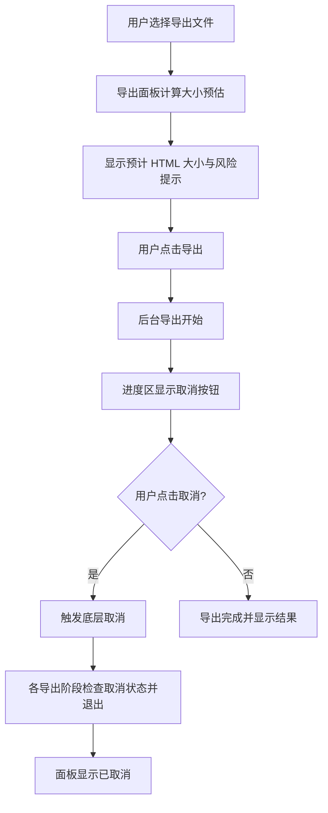

# Obsidian Webpage Export 导出大小预估与取消导出设计

## 背景

当前导出 HTML 时，如果笔记里嵌入了较大的视频或其他媒体文件，导出过程可能在 Obsidian 中持续很久，用户在导出完成前难以判断最终产物会有多大，也很难在发现导出明显过重时及时中止。

仓库当前已经具备后台导出、进度回调和取消底层批处理的能力，但导出面板还没有在导出前展示大小预估，也没有把取消能力完整暴露给用户。

## 目标

1. 在导出 HTML 的界面中，导出前给出尽量接近最终结果的大小预估。
2. 让用户在导出进行中可以主动取消导出。
3. 当预估值明显过大时，给出清晰的风险提示，减少无谓等待。

## 非目标

1. 不追求逐字节精确。
2. 不新增完整的真实 dry-run 渲染流程。
3. 不改变现有导出结果的结构或资源处理策略。
4. 不实现上传侧的大小预估。

## 预估思路

预估值以“尽量接近最终 HTML 大小”为原则，而不是单纯统计源文件大小。

### 主要纳入项

1. 页面最终 HTML 本身的大小。
2. `inlineMedia = true` 时，视频、图片、音频等被转成 base64 后的膨胀。
3. 单文件模式下，`websiteData.webpages[*].data` 对页面 HTML 的重复包装。
4. 单文件模式下，`websiteData.fileInfo[*].data` 对附件内容的重复包装。
5. `getCombinedHTML()` 中把 `websiteData` 和各条记录写入 `<data value="...">` 时带来的 JSON + base64 额外膨胀。

### 估算原则

1. 优先基于本次导出已知的文件清单和附件清单计算。
2. 对于二进制媒体，按 base64 膨胀系数估算，默认使用 `4 / 3` 再加少量属性包装开销。
3. 对 HTML 和 JSON 包装内容，按字符串长度直接估算。
4. 对于无法静态判断的动态内容，明确标注为“未完全计入”。

## 方案选择

推荐方案：**静态近似复刻当前导出编码路径**。

原因：

1. 它比单纯统计源大小更接近真实结果。
2. 它比完整 dry-run 更快，不会在导出前就把用户再拖进一次长时间渲染。
3. 它能直接解释“为什么会暴涨”，例如“视频在单文件模式下被重复内联和再次打包”。

## 界面设计

### 导出前

在导出面板结果区域新增一行预估信息：

- 预计最终 HTML 大小
- 预估耗时风险
- 主要膨胀来源摘要

当预估值超过阈值时，显示醒目的风险提示，例如：

- 预计导出文件很大，可能耗时很久
- 建议改用目录导出，或关闭媒体内联

### 导出中

在现有进度区域旁新增一个取消按钮：

- 按钮仅在导出运行时可用
- 点击后立即触发取消流程
- 点击后按钮变为禁用状态，避免重复触发

### 导出后

结果区继续展示现有的导出路径、发布结果和链接复制能力。

如果导出被取消，结果区明确显示“已取消”，并保留最近一次预估信息，方便用户判断是否需要调整设置后重试。

## 数据流

1. 用户在导出面板选择文件和导出路径。
2. 面板根据当前导出配置和选中文件计算大小预估。
3. 用户点击导出。
4. 导出流程开始后，进度区显示取消按钮。
5. 用户如点击取消，面板调用底层取消接口。
6. 底层渲染、网页构建和后续保存步骤检查取消状态并尽早退出。
7. 面板显示取消结果，并保持预估信息可见。

## 实现边界

### 导出面板

导出面板负责：

1. 发起预估计算。
2. 展示预估结果。
3. 在导出中显示取消按钮。
4. 触发取消操作。

### 预估器

新增一个轻量的估算模块，负责：

1. 读取当前导出配置。
2. 根据选中文件和已知资源大小推导预估值。
3. 输出总大小、主要来源和风险等级。

### 导出流程

导出流程负责：

1. 在保存和上传前检查取消状态。
2. 取消后避免继续写盘、上传或写入历史记录。
3. 维持现有错误与成功回报逻辑。

## 取消语义

取消导出时，语义按“尽快停止当前导出任务”处理：

1. 当前批处理尽量立即中断。
2. 已经开始的单个文件处理不做强制回滚。
3. 尚未开始的保存、压缩、上传、历史写入不再执行。
4. 面板上显示取消结果，不把取消当作错误。

## 交互细节

1. 未开始导出时，不显示取消按钮。
2. 导出开始后显示取消按钮。
3. 取消后按钮进入禁用态。
4. 重新打开面板或重新导出时，取消按钮恢复正常。
5. 预估值变化时自动刷新展示，不需要用户手动触发。

## 风险与限制

1. 预估值无法完全等于最终 HTML，因为动态插件内容、运行时注入和少量 DOM 变化仍可能带来偏差。
2. 对于特别大的视频，预估计算本身也需要读取附件元数据，但不应重新做一次完整渲染。
3. 如果用户选择的设置会让同一资源被多次打包，预估值会比“文件原始大小”高很多，这是符合预期的。

## 验证计划

1. 选择一个包含小视频的笔记，确认预估值明显高于源视频大小且方向正确。
2. 选择单文件导出，确认预估值会反映 base64 膨胀和 metadata 重复包装。
3. 导出过程中点击取消，确认导出停止，面板显示已取消。
4. 导出完成后确认现有发布和结果展示不受影响。
5. 运行构建检查，确认 TypeScript 和打包流程通过。

## 建议范围

本次优先实现：

1. 导出前大小预估。
2. 导出中取消按钮。
3. 取消后的状态展示。

本次不做：

1. 真实 dry-run 渲染。
2. 文件级逐项精确字节明细。
3. 导出后自动重新估算上传包大小。

