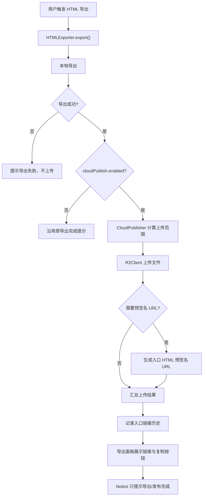

# 项目概览

## 项目简介

本项目是 `kosmosisdire/obsidian-webpage-export` 的本地 clone 版本，用于将 Obsidian 笔记导出为 HTML 页面、单文件 HTML 或完整网站目录。

原插件主线能力是“本地导出”：尽量保留 Obsidian 中的样式、页面结构、文件导航、搜索、图谱、反向链接、标签、别名等导出特性。本地定制版在此基础上新增了“云发布”能力：导出成功后可选择将产物上传到 Cloudflare R2，并为入口 HTML 生成预签名 URL。

本轮云发布能力的设计参考了 `../noteshare/项目概览.md` 中已经验证过的 R2、预签名 URL、Worker/KV 可撤销链接和 WebDAV 配置同步思路，但当前项目是 TypeScript + Obsidian 插件环境，因此实现方式按本仓库结构重新封装。

## 当前能力

项目当前支持原插件已有的主要能力：

- 导出单个文件、文件夹、当前文件或整个 vault
- 支持 Online Website、Local Website、Raw HTML Documents 三种导出模式
- 支持本地导出目录选择
- 导出完成后不再自动打开本地目录，避免打断当前 Obsidian 工作流
- 支持页面功能配置，包括侧边栏、文件导航、大纲、图谱、搜索、链接预览、主题切换、反向链接、标签、别名等
- 支持导出样式配置，包括主题、favicon、插件 CSS、特定 style id 等
- 支持多语言设置页

本地定制版新增能力：

- 在插件设置页增加“云发布 / Cloud Publish”配置区
- 可配置导出成功后自动上传到 Cloudflare R2
- 支持自动上传策略：
  - `combineAsSingleFile = true` 时上传导出的单个 HTML
  - `combineAsSingleFile = false` 时上传整个导出目录
- 可手动选择上传策略为单个 HTML 或整个目录
- 单文件 HTML 导出时，文件名默认跟随当前笔记的文件名，上传到 R2 的对象名也保持一致
- 可配置 R2 Account ID、Endpoint URL、Bucket、Access Key ID、Secret Access Key 和 object key 前缀
- 上传后可为入口 HTML 生成预签名 URL
- 可配置预签名 URL 过期秒数，最大按 `604800` 秒处理
- 导出面板支持本次导出的发布模式和过期时间快捷设置，不写回全局设置
- 导出面板本次云发布支持 `关闭`、`预签名 URL`、`可撤销链接` 三种临时选项
- 本次云发布开启时，可临时选择云端上传成功后是否保留本地 HTML 导出产物
- 上传后不保留本地产物时，仅在预签名 URL 模式上传成功且链接生成成功后清理本次实际上传的本地文件
- 云发布完成后在导出面板内显示发布链接，并提供一键复制按钮
- 支持通过命令面板查看云发布入口链接历史
- 未过期记录可直接复制，已过期记录只显示已过期状态，不再展示旧链接
- 同一入口 HTML 文件名只占一栏，重新导出同名笔记会用新链接替换旧记录
- 链接历史面板支持按笔记名搜索，并可按全部、未过期、已过期状态筛选
- 导出面板内显示后台导出进度条、当前阶段和当前文件
- 导出面板内在导出前显示预计最终 HTML 大小、风险等级和主要膨胀来源
- 导出面板内支持导出中取消，取消后尽量停止后续保存、上传和历史写入
- Obsidian 右上角通知只提示导出/发布完成，不再展示会自动消失的长链接
- 预留 Worker + KV 可撤销链接接口和设置项，但当前不实际创建或撤销链接
- 可配置 WebDAV URL、用户名、密码和远端配置路径
- 支持从 WebDAV 下载配置，并默认只覆盖云发布相关配置
- 支持从 WebDAV 下载完整插件配置，但执行前会二次确认

## 技术栈

- TypeScript
- Obsidian Plugin API
- Node.js 文件系统能力
- esbuild
- Cloudflare R2 S3 兼容 API
- AWS Signature V4 轻量签名实现
- WebDAV HTTP GET 配置下载
- `mime`
- `upath`

## 项目结构

```text
.
├── manifest-beta.json
├── package.json
├── package-lock.json
├── tsconfig.json
├── tsconfig.frontend.json
├── esbuild.config.mjs
├── build/
│   ├── manifest.json
│   ├── styles.css
│   └── main.js
├── src/
│   ├── plugin/
│   │   ├── main.ts
│   │   ├── exporter.ts
│   │   ├── cloud-publish/
│   │   │   ├── cloud-publish-settings.ts
│   │   │   ├── cloud-publish-history.ts
│   │   │   ├── cloud-publisher.ts
│   │   │   ├── r2-client.ts
│   │   │   ├── webdav-config-sync.ts
│   │   │   └── worker-link-client.ts
│   │   ├── settings/
│   │   │   ├── cloud-publish-history-modal.ts
│   │   │   ├── export-modal.ts
│   │   │   ├── settings.ts
│   │   │   └── settings-components.ts
│   │   ├── translations/
│   │   │   ├── language.ts
│   │   │   ├── en.ts
│   │   │   ├── zh-cn.ts
│   │   │   ├── it.ts
│   │   │   ├── pt.ts
│   │   │   └── uk.ts
│   │   ├── utils/
│   │   ├── website/
│   │   ├── features/
│   │   ├── asset-loaders/
│   │   └── render-api/
│   ├── frontend/
│   ├── shared/
│   └── assets/
├── docs/
│   └── superpowers/
│       └── specs/
│           ├── 2026-06-07-r2-cloud-publish-design.md
│           ├── 2026-06-08-cloud-publish-link-history-command.md
│           ├── 2026-06-08-export-modal-cloud-publish-temporary-options.md
│           └── 2026-06-08-export-size-estimate-and-cancel-design.md
└── 项目概览.md
```

说明：

- `build/`、`src/frontend/dist/` 和 `node_modules/` 当前属于构建或依赖产物，已被 Git 忽略或未进入本轮改动列表。
- 云发布相关设计文档在 `docs/superpowers/specs/`。

## 关键文件说明

### `src/plugin/main.ts`

Obsidian 插件入口。负责加载设置、初始化资源、注册 ribbon 图标、注册导出命令和文件菜单导出入口。

当前新增云发布链接历史命令：

- `View cloud publish link history`：打开云发布入口链接历史面板。

### `src/plugin/exporter.ts`

HTML 导出主协调文件。当前新增了导出成功后的云发布调用：

- 本地导出失败时不会上传
- 本地导出成功后，如果 `Settings.cloudPublish.enabled = true`，会调用 `CloudPublisher`
- 交互式导出会把导出和发布结果回填到 `ExportModal`
- 如果用户取消导出，会在保存、上传和历史写入前尽早退出
- 右上角 Notice 只提示导出/发布完成，不再包含预签名 URL
- 已移除导出完成后自动打开本地目录的调用
- 上传失败不会回滚本地导出结果
- 上传警告会写入 `ExportLog.warning`
- 云发布整体失败会写入 `ExportLog.error`
- 预签名 URL 创建成功后，会记录一条入口链接历史

### `src/plugin/settings/settings.ts`

插件设置模型和设置页渲染入口。

本轮新增：

- `Settings.cloudPublish`
- `Settings.cloudPublishHistory`
- 云发布设置区
- R2 配置输入项
- 上传策略选择
- 预签名 URL 配置
- Worker/KV 可撤销链接占位配置
- WebDAV 配置输入项
- “下载云发布配置”按钮
- “覆盖全部插件配置”按钮和二次确认弹窗

### `src/plugin/cloud-publish/cloud-publish-settings.ts`

云发布配置类型、默认值和清洗逻辑。

当前主要承担：

- 定义 `CloudPublishSettings`
- 定义 `CloudPublishMode`
- 定义 `CloudUploadStrategy`
- 提供 `DEFAULT_CLOUD_PUBLISH_SETTINGS`
- 提供 `sanitizeCloudPublishSettings`
- 提供 `pickCloudPublishSettings`
- 清理 R2 key 前缀和 WebDAV 远端路径
- 判断 R2 上传配置是否完整

### `src/plugin/cloud-publish/cloud-publish-history.ts`

云发布链接历史数据模块。

当前主要承担：

- 定义云发布链接历史记录类型
- 清洗历史记录，兼容旧配置或异常数据
- 追加新的入口链接历史，并最多保留 50 条
- 按入口 HTML 文件名归并历史记录，旧数据加载时也会折叠为同名最新一条
- 判断链接是否已过期
- 统一预签名 URL 过期秒数上限为 `604800`

### `src/plugin/cloud-publish/cloud-publisher.ts`

云发布编排模块。

当前主要承担：

- 根据导出配置解析上传策略
- 自动判断单文件导出或目录导出
- 扫描待上传文件
- 识别入口 HTML
- 将本地路径映射为 R2 object key
- 调用 `R2Client` 上传文件
- 调用 `R2Client` 生成入口文件预签名 URL
- 汇总上传数量、失败数量、入口 key、预签名 URL 和警告信息
- 上传循环中会检查取消状态，取消后不继续上传后续文件

### `src/plugin/cloud-publish/r2-client.ts`

Cloudflare R2 S3 兼容 API 客户端。

当前主要承担：

- 使用 `PUT Object` 上传文件
- 使用 AWS Signature V4 对上传请求签名
- 为入口 HTML 生成预签名 `GET` URL
- 自动推导默认 R2 endpoint
- 设置上传文件 `Content-Type`
- 对上传失败返回 HTTP 状态和响应摘要

说明：

- 当前没有引入 AWS SDK，采用轻量 Signature V4 实现。
- 如果后续真实 R2 验证发现签名兼容性问题，可切换到 `@aws-sdk/client-s3` 和 `@aws-sdk/s3-request-presigner`。

### `src/plugin/cloud-publish/webdav-config-sync.ts`

WebDAV 远端配置下载模块。

当前主要承担：

- 拼接 WebDAV 远端 JSON 配置 URL
- 支持 Basic Auth
- 使用 Obsidian `requestUrl` 下载远端配置
- 校验远端内容必须是 JSON
- 下载失败或 JSON 无效时不修改本地设置

说明：

- 当前只实现下载，不实现上传本地配置到 WebDAV。
- 默认按钮只覆盖 `Settings.cloudPublish`。
- 完整覆盖按钮会覆盖完整插件设置，并重建 `exportOptions` 的 feature option 实例。

### `src/plugin/cloud-publish/worker-link-client.ts`

Worker/KV 可撤销链接预留模块。

当前只定义：

- `RevocableLinkRequest`
- `RevocableLinkResult`
- `WorkerLinkClient.createLink()`

当前 `createLink()` 会直接抛出未实现错误，主流程不会调用它。

### `src/plugin/settings/export-modal.ts`

HTML 导出面板。当前新增：

- 导出按钮不再关闭面板，而是在面板保留状态下启动后台导出
- 本次导出可临时选择 `预签名 URL` 或 `可撤销链接`
- 本次导出可临时选择关闭云发布，即使全局云发布已开启也不影响全局配置
- 本次云发布开启时可临时选择是否在上传成功后保留本地 HTML 导出产物
- 本次导出可临时填写预签名 URL 过期秒数
- 临时发布设置只参与当前导出，不写回 `Settings.cloudPublish`
- 导出完成后在面板内显示导出路径、上传数量、警告和发布链接
- 导出前显示预计最终 HTML 大小、风险等级、选中文件数、预计页面数、附件数和媒体嵌入次数
- 对 `inlineMedia` 和 `combineAsSingleFile` 造成的体积膨胀显示来源摘要
- 导出过程中提供取消导出按钮，点击后调用底层取消流程并显示“正在取消”
- 导出过程中在面板内显示进度百分比、当前阶段和当前文件
- 发布链接旁提供一键复制按钮
- 可撤销链接仍为预留模式，当前会显示未实现警告，不会生成可撤销链接
- 点击导出时会取消待执行的导出大小预估刷新，不再等待或继续调度预估，避免首次打开面板时预估刷新与导出启动相互阻塞

### `src/plugin/website/export-size-estimator.ts`

导出大小预估模块。当前主要承担：

- 根据本次选中文件和当前 `ExportPipelineOptions` 估算最终 HTML 大小
- 统计媒体嵌入次数、唯一附件数量和页面数量
- 当 `inlineMedia = true` 时按 base64 膨胀估算媒体内联体积
- 当 `combineAsSingleFile = true` 时估算页面 HTML 被写入 `websiteData.webpages[*].data` 后的重复包装
- 当 `combineAsSingleFile = true` 时估算附件内容被写入 `websiteData.fileInfo[*].data` 后的重复包装
- 输出低、中、高三档风险等级，供导出面板展示

说明：

- 该模块不做完整 dry-run 渲染，因此不会在导出前重新跑一遍完整导出。
- 预估值以接近最终 HTML 体积为目标，但动态插件渲染、实际 DOM 清理和主题样式变化仍可能带来偏差。

### `src/plugin/settings/cloud-publish-history-modal.ts`

云发布链接历史面板。

当前主要承担：

- 由命令面板命令打开
- 按创建时间倒序展示入口链接历史
- 显示链接类型、R2 object key、创建时间、过期秒数、到期时间、上传数量和状态
- 支持按入口 HTML 文件名模糊搜索
- 支持按全部、未过期、已过期筛选状态
- 对未过期记录显示只读链接输入框和复制按钮
- 对已过期记录只显示“已过期”，不显示旧链接

### `src/plugin/translations/language.ts`

多语言类型定义。

本轮新增云发布相关文案字段，确保设置页在 TypeScript 层面有完整类型约束。

### `src/plugin/translations/zh-cn.ts`

中文设置页文案。

本轮云发布相关文案已完整补齐。

本轮新增导出大小预估与取消导出相关文案字段。

### `src/plugin/translations/en.ts`

英文设置页文案。

本轮云发布相关文案已完整补齐。

### `src/plugin/translations/it.ts`、`src/plugin/translations/pt.ts`、`src/plugin/translations/uk.ts`

意大利语、葡萄牙语、乌克兰语文案文件。

本轮为新增云发布字段先使用英文兜底，保证插件在这些语言环境下不会因缺字段构建失败或显示空内容。

本轮新增导出大小预估与取消导出相关字段，仍按英文兜底处理。

### `docs/superpowers/specs/2026-06-07-r2-cloud-publish-design.md`

本轮云发布功能的中文设计文档。

文档记录了：

- 背景
- 目标与非目标
- 设置页体验
- 配置结构
- 模块设计
- 数据流
- 错误处理
- 验证计划
- 风险与取舍
- 已确认的关键决策

### `docs/superpowers/specs/2026-06-08-cloud-publish-link-history-command.md`

云发布链接历史命令的中文设计文档。

文档记录了：

- 命令面板入口
- 入口链接历史的数据结构
- 同名入口 HTML 的归并规则
- 已过期链接不再显示旧 URL 的交互规则
- 不实现预签名 URL 续期的取舍
- 验证计划

### `docs/superpowers/specs/2026-06-08-export-size-estimate-and-cancel-design.md`

导出大小预估与取消导出的中文设计文档。

文档记录了：

- 大视频导致单文件 HTML 暴涨的背景
- 导出前预估最终 HTML 大小的目标与非目标
- 取消导出的交互语义
- 静态近似复刻当前导出编码路径的方案选择
- 数据流、风险限制和验证计划

## 云发布流程



## 上传策略说明

当前上传策略由 `Settings.cloudPublish.uploadStrategy` 控制：

- `auto`：默认策略
  - `combineAsSingleFile = true` 时上传单个 HTML
  - `combineAsSingleFile = false` 时上传整个导出目录
- `single-html`：强制上传单个 HTML
- `directory`：强制上传整个导出目录

入口文件规则：

- 单文件上传时，入口文件就是该 HTML，且文件名优先使用当前笔记的文件名
- 目录上传时，优先使用 `index.html`
- 如果目录中没有 `index.html`，使用扫描到的第一个 HTML 文件

R2 object key 规则：

- 使用 `keyPrefix` 作为可选前缀
- 目录上传时保留导出目录下的相对路径
- Windows 路径分隔符会转为 `/`

## 配置文件说明

插件配置由 Obsidian 插件数据管理，当前新增 `cloudPublish` 配置块。

核心字段包括：

- `cloudPublishHistory`
- `enabled`
- `uploadStrategy`
- `accountId`
- `accessKeyId`
- `secretAccessKey`
- `endpointUrl`
- `bucket`
- `keyPrefix`
- `publishMode`
- `createPresignedUrl`
- `presignedUrlExpireSeconds`
- `workerBaseUrl`
- `workerAdminToken`
- `webdavUrl`
- `webdavUsername`
- `webdavPassword`
- `webdavRemotePath`

其中 `cloudPublishHistory` 是本地入口链接历史数组，会保存预签名 URL、入口 object key、创建时间、过期秒数、到期时间和上传数量。历史记录按入口 HTML 文件名归并；同名笔记重新导出后，新记录替换旧记录。历史面板判断到期后不再展示旧 URL。

默认值：

- `enabled = false`
- `uploadStrategy = "auto"`
- `publishMode = "presigned-url"`
- `createPresignedUrl = true`
- `presignedUrlExpireSeconds = 604800`
- `webdavRemotePath = "obsidian-webpage-export/cloud-publish.json"`

安全说明：

- R2 Secret、Worker Admin Token 和 WebDAV 密码会保存在 Obsidian 插件数据中。
- 当前实现适合个人自用场景。
- 后续如果需要更高安全性，可扩展系统凭据存储或外部密钥管理。

## 运行方式

安装依赖：

```powershell
npm install
```

开发构建：

```powershell
npm run dev
```

生产构建：

```powershell
npm run build
```

说明：

- 当前本地第一次执行 `npm install` 时命令超过 120 秒超时退出，但 `node_modules/` 已生成，随后 `npm run build` 能正常完成。
- `node_modules/` 不应提交到 Git。

## 本轮改动记录

### 2026-06-07 云发布设计文档

本轮先创建中文 spec，路径为：

- `docs/superpowers/specs/2026-06-07-r2-cloud-publish-design.md`

主要确认：

- 上传策略采用自动判断：单文件导出上传单个 HTML，普通导出上传整个目录
- WebDAV 默认只覆盖云发布配置
- WebDAV 保留覆盖全部插件配置入口
- Worker/KV 可撤销链接本轮只预留接口，不实现

### 2026-06-07 云发布功能实现

本轮主要改动文件：

- `src/plugin/exporter.ts`
- `src/plugin/settings/settings.ts`
- `src/plugin/cloud-publish/cloud-publish-settings.ts`
- `src/plugin/cloud-publish/cloud-publisher.ts`
- `src/plugin/cloud-publish/r2-client.ts`
- `src/plugin/cloud-publish/webdav-config-sync.ts`
- `src/plugin/cloud-publish/worker-link-client.ts`
- `src/plugin/translations/language.ts`
- `src/plugin/translations/en.ts`
- `src/plugin/translations/zh-cn.ts`
- `src/plugin/translations/it.ts`
- `src/plugin/translations/pt.ts`
- `src/plugin/translations/uk.ts`

本轮主要改动内容：

- 新增云发布配置结构和清洗逻辑
- 新增 R2 上传和预签名 URL 生成能力
- 新增导出产物扫描和上传范围计算
- 新增 WebDAV 配置下载能力
- 新增 Worker/KV 可撤销链接预留接口
- 设置页新增云发布配置区
- 导出成功后接入云发布流程
- 补齐多语言文案类型和显示内容

### 2026-06-07 根目录项目概览

本轮新增：

- `项目概览.md`

用于记录当前项目定位、目录职责、云发布功能、配置说明、验证结论、当前限制和后续扩展方向。

### 2026-06-08 导出面板发布流程优化

本轮主要改动文件：

- `src/plugin/settings/export-modal.ts`
- `src/plugin/exporter.ts`
- `src/plugin/render-api/render-api.ts`
- `src/plugin/translations/language.ts`
- `src/plugin/translations/zh-cn.ts`
- `src/plugin/translations/en.ts`
- `src/plugin/translations/it.ts`
- `src/plugin/translations/pt.ts`
- `src/plugin/translations/uk.ts`
- `项目概览.md`

本轮主要改动内容：

- 导出面板新增“本次云发布”快捷设置，可临时选择发布模式和过期秒数
- 临时发布设置只影响当前导出，不保存到插件设置
- 点击导出后面板不关闭，导出和云发布在后台执行
- 交互式导出时关闭进度遮罩，避免导出过程切走当前面板
- 交互式导出时渲染 leaf 不再抢占右侧可视焦点
- 交互式导出时复用 `ExportLog` 进度回调，在导出面板内显示进度条、百分比、当前阶段和当前文件
- 导出完成后在面板内显示发布链接和复制按钮
- 右上角 Notice 不再展示预签名 URL，只提示导出和发布完成
- 删除导出完成后自动打开本地目录的行为
- 底层渲染批处理开始时尊重 `displayProgress = false`

### 2026-06-08 导出面板本次云发布临时选项

本轮新增中文 spec：

- `docs/superpowers/specs/2026-06-08-export-modal-cloud-publish-temporary-options.md`

本轮主要改动文件：

- `src/plugin/settings/export-modal.ts`
- `src/plugin/exporter.ts`
- `src/plugin/cloud-publish/cloud-publish-settings.ts`
- `src/plugin/cloud-publish/cloud-publisher.ts`
- `src/plugin/translations/language.ts`
- `src/plugin/translations/zh-cn.ts`
- `src/plugin/translations/en.ts`
- `src/plugin/translations/it.ts`
- `src/plugin/translations/pt.ts`
- `src/plugin/translations/uk.ts`
- `项目概览.md`

本轮主要改动内容：

- “本次云发布”下拉由两项改为三项：`关闭`、`预签名 URL`、`可撤销链接`
- `关闭` 只禁用本次导出的云发布，不修改全局云发布配置
- 云发布开启时显示子选项“云发布后保留本地 HTML 文件”
- 子选项默认开启；关闭后，仅在预签名 URL 模式上传成功且链接生成成功后删除本次导出的本地产物
- 本地产物清理按“本次实际成功上传的本地文件”执行，并清理变空目录，避免直接递归删除用户选择的父目录
- 可撤销链接仍为预留模式，当前不会触发上传后本地清理

### 2026-06-08 单文件 HTML 命名同步

本轮主要改动文件：

- `src/plugin/website/website.ts`
- `src/plugin/exporter.ts`
- `src/plugin/cloud-publish/cloud-publisher.ts`
- `项目概览.md`

本轮主要改动内容：

- 单文件 HTML 导出改为使用当前笔记的文件名作为输出文件名
- 云发布在单文件模式下改为按同一文件名定位并上传 R2
- 单文件 HTML 的本地落盘名和 R2 object key 保持一致，避免本地与云端命名分叉

### 2026-06-08 云发布链接历史命令

本轮新增中文 spec：

- `docs/superpowers/specs/2026-06-08-cloud-publish-link-history-command.md`

本轮主要改动文件：

- `src/plugin/main.ts`
- `src/plugin/exporter.ts`
- `src/plugin/settings/settings.ts`
- `src/plugin/cloud-publish/cloud-publish-history.ts`
- `src/plugin/settings/cloud-publish-history-modal.ts`
- `src/plugin/translations/language.ts`
- `src/plugin/translations/zh-cn.ts`
- `src/plugin/translations/en.ts`
- `src/plugin/translations/it.ts`
- `src/plugin/translations/pt.ts`
- `src/plugin/translations/uk.ts`
- `项目概览.md`

本轮主要改动内容：

- 命令面板新增“查看云发布链接历史”入口
- 插件配置新增 `cloudPublishHistory`，用于保存入口链接历史
- 预签名 URL 创建成功后记录入口 object key、链接、创建时间、过期秒数、到期时间和上传数量
- 同一入口 HTML 文件名只保留一条最新记录，避免重新导出后出现重复栏
- 链接历史面板按创建时间倒序展示记录
- 链接历史面板新增笔记名搜索框和状态筛选器
- 未过期记录显示只读链接和复制按钮
- 已过期记录只显示“已过期”，不再显示旧链接
- 不实现预签名 URL 续期或延长；如需续期，本质应重新生成新 URL

### 2026-06-08 导出大小预估与取消导出

本轮新增中文 spec：

- `docs/superpowers/specs/2026-06-08-export-size-estimate-and-cancel-design.md`

本轮主要改动文件：

- `src/plugin/settings/export-modal.ts`
- `src/plugin/website/export-size-estimator.ts`
- `src/plugin/features/file-picker.ts`
- `src/plugin/exporter.ts`
- `src/plugin/cloud-publish/cloud-publisher.ts`
- `src/plugin/render-api/render-api.ts`
- `src/plugin/translations/language.ts`
- `src/plugin/translations/zh-cn.ts`
- `src/plugin/translations/en.ts`
- `src/plugin/translations/it.ts`
- `src/plugin/translations/pt.ts`
- `src/plugin/translations/uk.ts`
- `项目概览.md`

本轮主要改动内容：

- 导出面板新增“导出大小预估”区域
- 预估器根据选中文件、媒体嵌入、`inlineMedia` 和 `combineAsSingleFile` 估算最终 HTML 体积
- 预估结果展示预计大小、风险等级、文件数、页面数、附件数、媒体嵌入次数和主要膨胀来源
- 文件选择树新增选择变化回调，勾选文件后自动刷新预估
- 导出面板新增“取消导出”按钮，导出中可触发底层取消
- `ExportLog` 新增取消门面和取消状态读取门面
- 本地保存前、上传前、上传循环中、历史写入前检查取消状态，取消后尽早退出
- 多语言补齐导出大小预估与取消按钮文案；非中文语言先使用英文兜底

### 2026-06-08 单文件大 HTML 保存响应性优化

本轮主要改动文件：

- `src/plugin/website/website.ts`
- `项目概览.md`

本轮主要改动内容：

- `saveAsCombinedHTML()` 不再先用 `DOMParser` 和 `outerHTML` 一次性生成完整单文件 HTML 字符串
- 单文件 HTML 保存改为异步分段输出，页面 HTML、head 引用和 metadata data 节点都会按块写入
- `websiteData`、页面数据和附件数据的 JSON + `encodeURI` + base64 包装改为分段处理
- 每个分段之间让出事件循环，并检查 `ExportLog.wasCancelled()`
- 目标是让 Obsidian 在超大单文件 HTML 保存阶段仍有机会响应“取消导出”按钮
- 仍保留 `getCombinedHTML()` 作为兼容接口，但内部改为消费分段生成器后拼回字符串

### 2026-06-08 导出面板首次导出闪退排查与修复

本轮主要改动文件：

- `src/plugin/settings/export-modal.ts`
- `项目概览.md`

本轮主要改动内容：

- 排查“首次打开导出面板后点击导出，面板偶发像闪退；再次打开后可正常导出”的时序问题
- 发现导出面板打开后会自动触发一次导出大小预估，而导出按钮点击时又同步等待一次大小预估完成
- 首次打开时 Obsidian 元数据和附件读取缓存尚未预热，两次预估可能与导出启动争用资源，导致用户看到导出面板提前关闭或导出没有顺利接上
- 导出按钮改为取消待执行的预估刷新，不再等待预估完成后才启动导出
- 导出大小预估继续作为面板提示能力保留，预估慢或失败不影响真正导出流程

## 验证结果

已执行：

```powershell
npm run build
```

结果：

- `tsc -noEmit -skipLibCheck` 通过
- `node esbuild.config.mjs production` 通过
- `build/main.js` 成功生成，并同步复制了 `build/manifest.json` 与 `build/styles.css`

2026-06-08 本轮优化后再次执行：

```powershell
npm run build
```

结果：

- `tsc -noEmit -skipLibCheck` 通过
- `node esbuild.config.mjs production` 通过
- `build/main.js` 成功生成，并同步复制了 `build/manifest.json` 与 `build/styles.css`

已执行：

```powershell
git diff --check
```

结果：

- 无空白错误
- 仅提示 Windows 下部分文件未来可能被 Git 转为 CRLF

未完成的真实端到端验证：

- 尚未使用真实 Cloudflare R2 密钥测试上传
- 尚未使用真实 R2 预签名 URL 验证访问
- 尚未使用真实 WebDAV 服务测试远端配置下载

原因：

- 当前工作区没有可用的 R2/WebDAV 账号配置和密钥。

## 当前限制

- 当前不支持 R2 multipart 断点续传
- 当前不显示逐文件上传进度，只在完成后汇总结果
- 当前导出大小预估不是逐字节精确；动态插件渲染、实际 DOM 输出和主题样式仍可能造成偏差
- 当前链接历史只记录入口 HTML 的发布链接，不记录每个上传资源文件的链接
- 当前链接历史按入口 HTML 文件名归并，不区分同名文件所在的不同文件夹
- 当前不支持分享历史
- 当前不实现 Worker + KV 可撤销链接，只预留接口
- 当前不支持撤销已生成的预签名 URL
- 当前不支持 WebDAV 上传本地配置
- 当前不支持 WebDAV 自动同步、冲突合并和版本历史
- 当前 R2 签名使用轻量 Signature V4 实现，真实 R2 兼容性仍需端到端验证
- 当前密钥类配置以明文形式保存在 Obsidian 插件数据中

## 后续可扩展方向

- 使用真实 R2 小文件验证上传和预签名 URL
- 如果轻量签名实现存在兼容性问题，切换到 AWS SDK v3
- 增加上传进度 Modal
- 增加上传历史列表
- 增加 WebDAV 上传本地配置
- 增加 WebDAV 自动同步和同步前备份
- 实现 Worker + KV 可撤销链接
- 增加可撤销链接历史和撤销操作
- 增加访问统计、访问密码和分享备注
- 增加更安全的密钥存储方式
